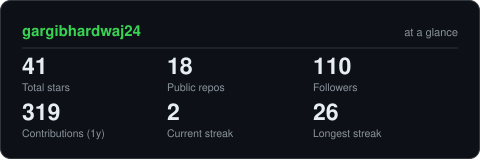
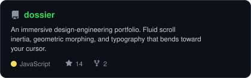
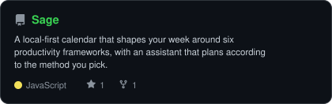
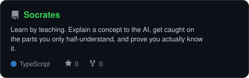

<div align="center">

<!-- PORTRAIT - generated by scripts/dotify.py from assets/jacket.png.
     Colour mode, so one file serves both GitHub themes. Regenerate with:
       python scripts/dotify.py assets/jacket.png -o assets/portrait \
         --cols 100 --equalize --detail 0.5 --color -->


<br>

<!-- NAME / TAGLINE - animated typing -->
<a href="https://github.com/webshubham259">
  
</a>

<br>

<!-- SOCIALS -->
<a href="https://www.linkedin.com/in/shubham-jangra-83a287257"></a>
<a href="mailto:shubhamjangra259@gmail.com"></a>
<a href="https://shubham-jangra.netlify.app/"></a>
<a href="https://leetcode.com/u/Shubham_Jangra_/"></a>


</div>

---

## `~/` whoami

```console
$ cat about.txt
```

Hi, I'm **Shubham**, a first-year Computer Science and Engineering (AI/ML) student focused on backend development.

- **Focus**: Building reliable backend systems with clean architecture and scalable solutions.
- **Enjoy**: Building scalable, production-ready APIs with Python, Java, Rust, and C.
- **Learning**: C++, Assembly, SQLAlchemy, and Redis, while sharpening my problem-solving skills with DSA.
- **Goal**: Write clean code, build reliable software, and create systems that last.

<br>

<div align="center">

## `~/` toolbox


  &nbsp;&nbsp;
  
  &nbsp;&nbsp;
  
  &nbsp;&nbsp;
  
  &nbsp;&nbsp;
  
  &nbsp;&nbsp;
  
  &nbsp;&nbsp;
  

</div>

---

<div align="center">

## `~/` skill radar

<table>
<tr>
<td width="50%" align="center" valign="middle">

<!-- Self-rated radar - edit assets/skills.json, the workflow redraws it -->
<picture>
  <source media="(prefers-color-scheme: dark)"  srcset="assets/radar-dark.svg">
  <source media="(prefers-color-scheme: light)" srcset="assets/radar-light.svg">
  
</picture>

</td>
<td width="50%" align="center" valign="middle">

<!-- Live radar built from real language byte counts across your repos -->
<picture>
  <source media="(prefers-color-scheme: dark)"  srcset="assets/radar-langs-dark.svg">
  <source media="(prefers-color-scheme: light)" srcset="assets/radar-langs-light.svg">
  
</picture>

</td>
</tr>
</table>

</div>

---

<div align="center">

## `~/` contribution calendar

<!-- 3D isometric calendar, regenerated every 6h by .github/workflows/metrics.yml -->


<br><br>

<!-- Snake eats the contribution graph - .github/workflows/snake.yml -->
<picture>
  <source media="(prefers-color-scheme: dark)"  srcset="https://raw.githubusercontent.com/webshubham259/webshubham259/output/snake-dark.svg">
  <source media="(prefers-color-scheme: light)" srcset="https://raw.githubusercontent.com/webshubham259/webshubham259/output/snake.svg">
  
</picture>

</div>

---

<div align="center">

## `~/` the numbers

<!-- Generated by scripts/cards.py into this repo. Deliberately NOT
     github-readme-stats / streak-stats / github-profile-trophy: those are
     shared public instances that go down and take the whole section with them. -->
<picture>
  <source media="(prefers-color-scheme: dark)"  srcset="assets/card-stats-dark.svg">
  <source media="(prefers-color-scheme: light)" srcset="assets/card-stats-light.svg">
  
</picture>

<br>


<br><br>


</div>

---

<div align="center">

## `~/` selected work

<!-- Cards generated by scripts/cards.py from assets/projects.json.
     Stars, forks and language are pulled live from the API on every run. -->
<table>
<tr>
<td width="50%">
  <a href="https://github.com/webshubham259/eureka">
    <picture>
      <source media="(prefers-color-scheme: dark)"  srcset="assets/card-dossier-dark.svg">
      <source media="(prefers-color-scheme: light)" srcset="assets/card-dossier-light.svg">
      
    </picture>
  </a>
</td>
<td width="50%">
  <a href="https://github.com/webshubham259/Sage">
    <picture>
      <source media="(prefers-color-scheme: dark)"  srcset="assets/card-Sage-dark.svg">
      <source media="(prefers-color-scheme: light)" srcset="assets/card-Sage-light.svg">
      
    </picture>
  </a>
</td>
</tr>
<tr>
<td width="50%">
  <a href="https://github.com/webshubham259/Socrates">
    <picture>
      <source media="(prefers-color-scheme: dark)"  srcset="assets/card-Socrates-dark.svg">
      <source media="(prefers-color-scheme: light)" srcset="assets/card-Socrates-light.svg">
      
    </picture>
  </a>
</td>
</tr>
</table>

</div>

---

<div align="center">

<sub>`01110100 01101000 01100001 01101110 01101011 01110011 00100000 01100110 01101111 01110010 00100000 01110011 01100011 01110010 01101111 01101100 01101100 01101001 01101110 01100111`</sub>

</div>
