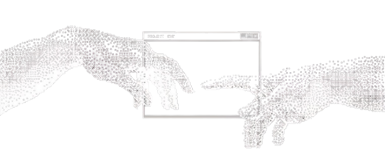

  

<h1 align="center">Hey 👋, Im Shubham Jangra</h1>

<h3 align="center">AI Engineer</h3>

  

Building reliable backend systems with clean architecture and scalable solutions.

##  <h2 align="center">🚀 About Me </h2>

**Shubham**, Here  — a first-year Computer Science and Engineering in (AI/ML), student focused on backend development.

I enjoy building scalable, production-ready APIs with Python, Java, Rust, C and continuously improving my understanding of real-world backend systems.

Currently, I'm learning **C++, Assembly, SQLAlchemy, and Redis**, while sharpening my problem-solving skills through **Data Structures & Algorithms**.

My goal is simple: write clean code, build reliable software, and grow into a software engineer who creates systems that forms.

 

 <h2 align="center">🤝 Connect</h2>

  
  &nbsp;&nbsp;&nbsp;
  
  &nbsp;&nbsp;&nbsp;
  

<h2 align="center">💻 Tech Stack</h2>

  

  
  &nbsp;&nbsp;
  
  &nbsp;&nbsp;
  
  &nbsp;&nbsp;
  
  &nbsp;&nbsp;
  
  &nbsp;&nbsp;
  
  &nbsp;&nbsp;
  

<h2 align="center">📊 GitHub Stats</h2>

<h2 align="center">📈 Activity Graph</h2>

  

### 
<h2 align="center">⌘ Commit Activity</h2>

<picture>
  <source media="(prefers-color-scheme: dark)"
    srcset="https://raw.githubusercontent.com/midnightshady/midnightshady/output/pacman-contribution-graph-dark.svg">

  <source media="(prefers-color-scheme: light)"
    srcset="https://raw.githubusercontent.com/midnightshady/midnightshady/output/pacman-contribution-graph.svg">

  

<h2 align="center">⌘ Philosophy</h2>

  <em>"Your infrastructure is either built to last or built to fail. I choose the former....."</em>
   
  <strong>— Shubham Jangra</strong>

<!-- Proudly created with GPRM ( https://gprm.itsvg.in ) -->
